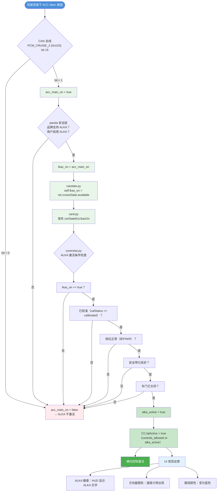
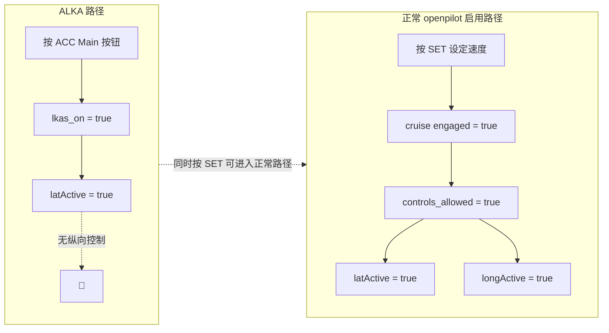

# ALKA（始终在线车道保持辅助）设计 v3

## 概述

ALKA 在 ACC 主开关开启时启用横向控制（转向），无需巡航功能实际启动。这使得车道保持辅助可以独立于纵向控制运行。

**简化行为（v3）：**
- 所有品牌使用直接跟踪：`lkas_on = acc_main_on`
- 无需按钮/开关跟踪（移除了 TJA、LKAS 按钮、LKAS HUD）
- ACC 主开关开启 = ALKA 启用，ACC 主开关关闭 = ALKA 禁用

---

## 各品牌汇总

| 品牌 | 状态 | ACC 主信号来源 | 备注 |
|------|:----:|----------------|------|
| Body | 禁用 | - | 无转向能力 |
| Chrysler | 禁用 | - | 需要特殊处理 |
| Ford | 启用 | EngBrakeData (0x165) CcStat | |
| GM | 禁用 | - | 无 ACC Main 信号 |
| Honda Nidec | 启用 | SCM_FEEDBACK (0x326) MAIN_ON | |
| Honda Bosch | 启用 | SCM_FEEDBACK (0x326) MAIN_ON | |
| Hyundai | 启用 | SCC11 (0x420) bit 0 | |
| Hyundai CAN-FD | 启用 | SCC_CONTROL (0x1A0) bit 66 | |
| Hyundai Legacy | 启用 | SCC11 (0x420) bit 0 | |
| Mazda | 启用 | CRZ_CTRL (0x21C) bit 17 | |
| Nissan | 启用 | CRUISE_THROTTLE (0x239) bit 17 | |
| PSA | 禁用 | - | 未实现 |
| Rivian | 禁用 | - | 不同架构 |
| Subaru | 启用 | CruiseControl (0x240) bit 40 | |
| Subaru Preglobal | 启用 | CruiseControl (0x144) bit 48 | |
| Tesla | 禁用 | - | 不同架构 |
| Toyota | 启用 | PCM_CRUISE_2 (0x1D3) bit 15 | |
| Toyota (UNSUPPORTED_DSU) | 启用 | DSU_CRUISE (0x365) bit 0 | |
| VW MQB | 启用 | TSK_06 TSK_Status (>=2) | |
| VW PQ | 启用 | Motor_5 (0x480) bit 50 (long) | |

---

## 权限模型

横向控制需要在两个层面进行检查。正常路径使用 `controls_allowed`，ALKA 路径使用额外检查。

| 检查项 | Panda | openpilot | 备注 |
|--------|:-----:|:---------:|------|
| **正常路径** |
| `controls_allowed`（巡航启用） | ✓ | ✓ | 此路径或 ALKA 路径二选一 |
| **ALKA 路径** |
| `alka_allowed`（品牌支持） | ✓ | ✓ | 在安全初始化中按品牌设置 |
| `ALT_EXP_ALKA`（用户启用） | ✓ | ✓ | alternativeExperience 标志 |
| `lkas_on`（ACC 主开关开启） | ✓ | ✓ | 通过 CAN 消息跟踪 |
| `vehicle_moving` / `!standstill` | ✓ | ✓ | |
| **openpilot 额外检查** |
| `gear_ok`（非 P/N/R 挡） | ✗ | ✓ | 仅在 Python 层 |
| `calibrated`（已校准） | ✗ | ✓ | 仅在 Python 层 |
| `seatbelt latched`（安全带系好） | ✗ | ✓ | 仅在 Python 层 |
| `doors closed`（车门关闭） | ✗ | ✓ | 仅在 Python 层 |
| `!steerFaultTemporary`（无临时转向故障） | ✗ | ✓ | 仅在 Python 层 |
| `!steerFaultPermanent`（无永久转向故障） | ✗ | ✓ | 仅在 Python 层 |

---

## 数据流

```
┌─────────────────────────────────────────────────────────────────────┐
│                          CAN 总线                                     │
└─────────────────────────────────────────────────────────────────────┘
                    │                              │
                    ▼                              ▼
┌─────────────────────────────────┐  ┌─────────────────────────────────┐
│  安全层（panda C 代码）          │  │  Python 层                      │
│                                 │  │                                 │
│  rx_hook:                       │  │  carstate.py:                   │
│  - 解析 ACC Main 信号           │  │  - 解析 cruiseState.available   │
│  - 设置 lkas_on = acc_main_on   │  │  - 设置 self.lkas_on            │
│                                 │  │                                 │
│  lat_control_allowed():         │  └─────────────┬───────────────────┘
│  - 检查 lkas_on + 其他标志      │                │
│  - 门控转向命令                  │                ▼
└─────────────────────────────────┘  ┌─────────────────────────────────┐
                                     │  card.py:                       │
                                     │  - 发布 carStateExt.lkasOn      │
                                     └─────────────┬───────────────────┘
                                                   │
                                                   ▼
                                     ┌─────────────────────────────────┐
                                     │  controlsd.py:                  │
                                     │  - 读取 carStateExt.lkasOn      │
                                     │  - 检查 ALKA 条件               │
                                     │  - 设置 CC.latActive            │
                                     └─────────────────────────────────┘
```

### 关键文件

| 文件 | 用途 |
|------|------|
| `custom.capnp` | 定义包含 `lkasOn` 字段的 `CarStateExt` 结构体 |
| `log.capnp` | 在事件联合体中包含 `carStateExt` |
| `interfaces.py` | 在 `CarStateBase` 中定义默认值 `self.lkas_on = False` |
| `carstate.py`（按品牌） | 根据 ACC Main 跟踪 `lkas_on` |
| `card.py` | 从 `CI.CS.lkas_on` 发布 `carStateExt.lkasOn` |
| `controlsd.py` | 读取 `carStateExt.lkasOn` 判断 `alka_active` |

---

## 控制状态机流程图

以下流程图展示了从按下 ACC Main 按钮到横向控制激活的完整逻辑链路（以丰田卡罗拉为例）：



### ALKA 对比正常启用流程



### 状态汇总

| 操作 | lkas_on | controls_allowed | latActive | longActive | 提醒 |
|------|:-------:|:----------------:|:---------:|:----------:|------|
| ACC Main OFF | false | false | false | false | 无 |
| ACC Main ON（ALKA激活） | **true** | false | **true** | false | 仅 HUD 图标（无弹窗） |
| ACC Main ON + 按 SET | **true** | **true** | **true** | **true** | 正常 OP 启用提示 |
| ACC Main ON + 条件不满足（未校准等） | **true** | false | false | false | 无 |

---

## ACC Main 跟踪

所有品牌使用简单的直接跟踪：

```c
// Panda（C 代码）
if (alka_allowed && (alternative_experience & ALT_EXP_ALKA)) {
  lkas_on = acc_main_on;  // 或 GET_BIT(msg, bit_position)
}
```

```python
# Python carstate.py
self.lkas_on = ret.cruiseState.available
```

此守卫确保：
1. 品牌支持 ALKA（`alka_allowed`）
2. 用户启用了 ALKA（`ALT_EXP_ALKA`）

若不同时满足这两个条件，则不会进行 ACC Main 跟踪，ALKA 保持禁用状态。

---

## 测试

安全测试验证：
- 每个品牌的 `alka_allowed` 标志设置正确
- ACC Main 跟踪直接更新 `lkas_on`
- `lat_control_allowed()` 仅在所有条件满足时返回 true
- 当 ALKA 条件不满足时，转向 TX 被阻止
- 总线路由变体（camera_scc、unsupported_dsu）
